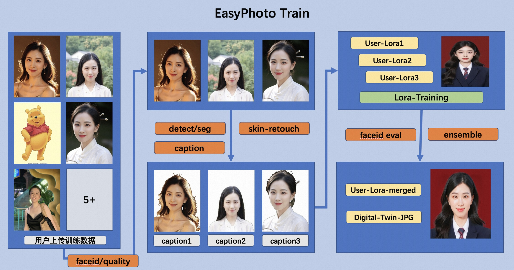

# EasyPhoto | 您的智能 AI 照片生成器。

# 简介

[English](./README.md) | 简体中文

EasyPhoto是一款Webui UI插件，用于生成AI肖像画，该代码可用于训练与您相关的数字分身。建议使用 5 到 20 张肖像图片进行训练，最好是半身照片且不要佩戴眼镜（少量可以接受）。训练完成后，我们可以在推理部分生成图像。我们支持使用预设模板图片与上传自己的图片进行推理。

这些是我们的生成结果:

我们的ui界面如下:  
**训练部分:**

**预测部分:**

# 新功能
- 创建代码！现在支持 Windows 和 Linux。[🔥 2023.09.02]

# TODO List
- 支持中文界面。
- 支持模板背景部分变化。
- 支持高分辨率。
- 支持多人模板。

# 快速启动
### 1. 环境检查
我们已验证EasyPhoto可在以下环境中执行：   

Windows 10 的详细信息：  
- 操作系统： Windows10
- python: python 3.10
- pytorch: torch2.0.1
- tensorflow-cpu: 2.13.0
- CUDA: 11.7
- CUDNN: 8+
- GPU： Nvidia-3060 12G

Linux 的详细信息：  
- 操作系统 Ubuntu 20.04, CentOS
- python: python3.10 & python3.11
- pytorch: torch2.0.1
- tensorflow-cpu: 2.13.0
- CUDA: 11.7
- CUDNN: 8+
- GPU： Nvidia-A10 24G & Nvidia-V100 16G & Nvidia-A100 40G

我们需要大约 60GB 的可用磁盘空间（用于保存权重和数据集），请检查！

### 2. 相关资料库和权重下载
#### a. Controlnet 
我们需要使用 Controlnet 进行推理。相关软件源是[Mikubill/sd-webui-controlnet](https://github.com/Mikubill/sd-webui-controlnet)。在使用 EasyPhoto 之前，您需要安装这个软件源。

此外，我们至少需要三个 Controlnets 用于推理。因此，您需要设置 **Multi ControlNet: Max models amount (requires restart)**。

#### b. 其他依赖关系。
我们与现有的 stable-diffusion-webui 环境相互兼容，启动 stable-diffusion-webui 时会安装相关软件源。

我们所需的权重会在第一次开始训练时自动下载。

### 3. 插件安装
现在我们支持从 git 安装 EasyPhoto。我们的仓库网址是 https://github.com/aigc-apps/EasyPhoto-sd-webui。

今后，我们将支持从 **Available** 安装 EasyPhoto。

# 算法详细信息

#### 1.架构概述

在人工智能肖像领域，我们希望模型生成的图像逼真且与用户相似，而传统方法会引入不真实的光照（如人脸融合或roop）。为了解决这种不真实的问题，我们引入了稳定扩散模型的图像到图像功能。生成完美的个人肖像需要考虑所需的生成场景和用户的数字二重身。我们使用一个预先准备好的模板作为所需的生成场景，并使用一个在线训练的人脸 LoRA 模型作为用户的数字二重身，这是一种流行的稳定扩散微调模型。我们使用少量用户图像来训练用户的稳定数字二重身，并在推理过程中根据人脸 LoRA 模型和预期生成场景生成个人肖像图像。

### 训练细节

首先，我们对输入的用户图像进行人脸检测，确定人脸位置后，按照一定比例截取输入图像。然后，我们使用显著性检测模型和皮肤美化模型获得干净的人脸训练图像，该图像基本上只包含人脸。然后，我们为每张图像贴上一个固定标签。这里不需要使用标签器，而且效果很好。最后，我们对稳定扩散模型进行微调，得到用户的数字二重身。  

在训练过程中，我们会利用模板图像进行实时验证，在训练结束后，我们会计算验证图像与用户图像之间的人脸 ID 差距，从而实现 Lora 融合，确保我们的 Lora 是用户的完美数字二重身。

此外，我们将选择验证中与用户最相似的图像作为 face_id 图像，用于推理。

### 3.推理细节
#### a.第一次扩散：  
首先，我们将对接收到的模板图像进行人脸检测，以确定为实现稳定扩散而需要涂抹的遮罩。然后，我们将使用模板图像与最佳用户图像进行人脸融合。人脸融合完成后，我们将使用上述遮罩对融合后的人脸图像进行内绘（fusion_image）。此外，我们还将通过仿射变换（replace_image）把训练中获得的最佳 face_id 图像贴到模板图像上。然后，我们将对其应用 Controlnets，在融合图像中使用带有颜色的 canny 提取特征，在替换图像中使用 openpose 提取特征，以确保图像的相似性和稳定性。然后，我们将使用稳定扩散（Stable Diffusion）结合用户的数字分割进行生成。

#### b.第二次扩散：
在得到第一次扩散的结果后，我们将把该结果与最佳用户图像进行人脸融合，然后再次使用稳定扩散与用户的数字二重身进行生成。第二次生成将使用更高的分辨率。

## 参考文献
- insightface：https://github.com/deepinsight/insightface    
- cv_resnet50_face：https://www.modelscope.cn/models/damo/cv_resnet50_face-detection_retinaface/summary  
- cv_u2net_salient：https://www.modelscope.cn/models/damo/cv_u2net_salient-detection/summary 
- cv_unet_skin_retouching_torch：https://www.modelscope.cn/models/damo/cv_unet_skin_retouching_torch/summary   
- cv_unet-image-face-fusion：https://www.modelscope.cn/models/damo/cv_unet-image-face-fusion_damo/summary  
- kohya：https://github.com/bmaltais/kohya_ss
- controlnet-webui：https://github.com/Mikubill/sd-webui-controlnet

# 许可证
本项目采用 [Apache License (Version 2.0)](https://github.com/modelscope/modelscope/blob/master/LICENSE).